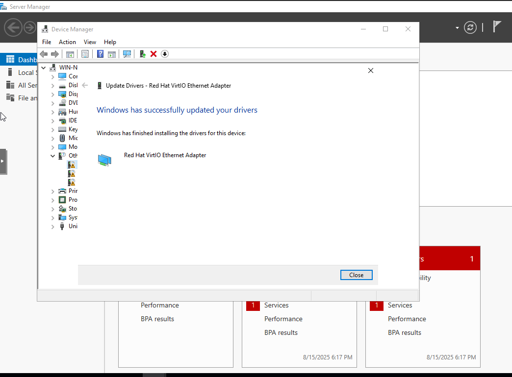

# Error #3 – VirtIO NIC Driver Missing

## Context (What I Was Doing)
While configuring the Windows Server 2019 VM (**Win-Server-AD**) on Proxmox with a VirtIO network adapter, Device Manager showed the NIC was not recognized. The VM had no working network connectivity.

## Error Message
Device Manager displayed the NIC under **Other devices** as *Ethernet Controller* with a yellow exclamation mark.

## Root Cause
Windows Server installation media does not ship with VirtIO drivers. Since the VM network interface was configured as a **Red Hat VirtIO Ethernet Adapter**, the OS could not automatically load a driver.

## Fix Applied
1. Mounted the VirtIO ISO (`virtio-win-0.1.271.iso`) in Proxmox as a secondary CD drive.  
2. In Device Manager → *Right-click NIC → Update Driver → Browse*.  
3. Navigated to the VirtIO ISO contents.  
4. Selected the correct driver for the NIC.  
5. Successfully installed the **Red Hat VirtIO Ethernet Adapter** driver.  
6. Verified NIC appeared under *Network adapters* without warnings.

### Screenshots
  
  
  
  

## Lesson Learned
When using VirtIO hardware for Windows VMs in Proxmox, VirtIO drivers must be installed manually from the ISO. Always keep the VirtIO ISO mounted during installation/configuration to resolve missing device driver errors quickly.
