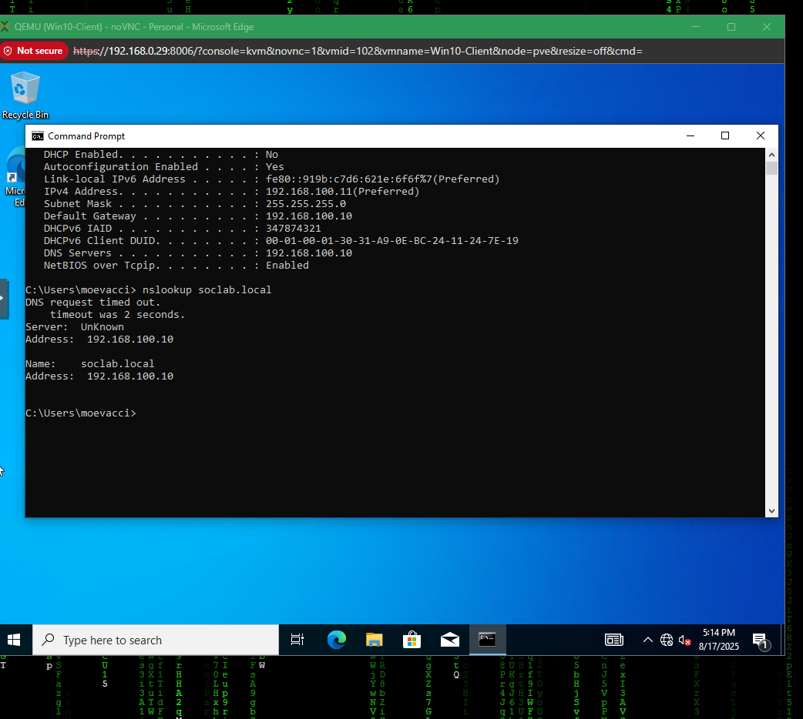

# Error #6 – DNS Resolution Failure During Domain Join  

## Context (What I Was Doing)  
I was attempting to join the Windows 10 client (192.168.100.11) to the `soclab.local` domain after promoting the Server 2019 VM (192.168.100.10) to a Domain Controller with DNS.  

Even though pings between client and server succeeded, DNS lookups (`nslookup`) were not resolving consistently, which prevented the domain join process.  

## Error Message  

**Client-side (`192.168.100.11`):**  
C:\Users\moevacci> nslookup soclab.local
DNS request timed out.
timeout was 2 seconds.
Server: UnKnown
Address: 192.168.100.10

scss
Copy code
  

**Server-side (`192.168.100.10`):**  
C:\Users\Administrator> nslookup 192.168.100.10
*** UnKnown can't find 192.168.100.10: Non-existent domain

markdown
Copy code
  

## Root Cause  
- The **DNS service on the Domain Controller** had not fully registered its resource records after promotion.  
- The Forward Lookup Zone (`soclab.local`) existed but was incomplete until the DNS service was refreshed.  
- Client lookups were hitting stale or missing records in the DNS cache.  

## Fix Applied  
1. On the Domain Controller:  
   ```bash
   ipconfig /registerdns
   net stop dns
   net start dns
This forced re-registration of DNS records and restarted the service.


On the Windows 10 client:

bash
Copy code
ipconfig /flushdns
nslookup soclab.local
This cleared stale cache, allowing the client to resolve the domain properly.


After confirming lookups resolved, the client was able to successfully join the domain.


Lesson Learned
DNS is critical for AD: domain joins depend entirely on DNS, not just network connectivity.

Always run ipconfig /registerdns and restart the DNS service after promoting a Domain Controller.

Flush client caches (ipconfig /flushdns) to eliminate stale entries during troubleshooting.

Verify Forward Lookup Zones in DNS Manager before attempting domain joins.
