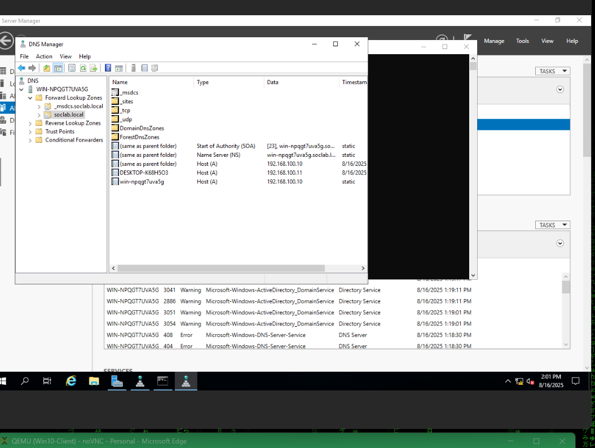

# Step 6 – DNS Configuration & Domain Join

In this step, we configured DNS inside the SOC lab and tested domain join functionality between the Windows Server (AD/DNS) and the Windows 10 Client. This included creating a domain user, verifying DNS zones, adding host (A) records, and validating client-to-domain resolution.

---

## Actions Taken

1. **Created AD User Account**  
   - Created a new user `moevacci` in Active Directory Users and Computers (ADUC).  
   - Ensured the account was set to never expire and ready for login.  

     
   *(original: 12-ad-user-created.jpg)*  

2. **Verified DNS Forward Lookup Zones**  
   - Checked DNS Manager to confirm the `soclabs.local` forward lookup zone was present.  
   - Observed both the `_msdcs` and primary `soclabs.local` zones were running but unsigned.  

     
   *(original: dns-manager-forward-zones.png)*  

3. **Manually Added Host (A) Records**  
   - Added `A` records for the Windows 10 Client and the AD Server for proper name-to-IP resolution.  
   - Confirmed entries matched the assigned static IPs in the isolated lab network.  

     
   *(original: adding 'A' networks.png)*  

4. **Validated Domain Join via Ping and nslookup**  
   - From the Windows 10 Client, successfully pinged `soclabs.local` which resolved to the server’s IP.  
   - `nslookup` returned correct resolution, though intermittent IPv6 timeout errors were observed (seed for Error 5).  

     
   *(original: final ping nslookup.jpg)*  

---

## Result
- Domain DNS zones successfully configured.  
- Windows 10 Client able to ping and partially resolve `soclabs.local`.  
- AD user `moevacci` created and ready for domain login.  

---

## Next Steps
- Troubleshoot IPv6-related DNS resolution issues (see **Error 5 – DNS IPv6 Misconfiguration**).  
- Join the Windows 10 Client to the domain using the `SOCLAB\moevacci` account.  
