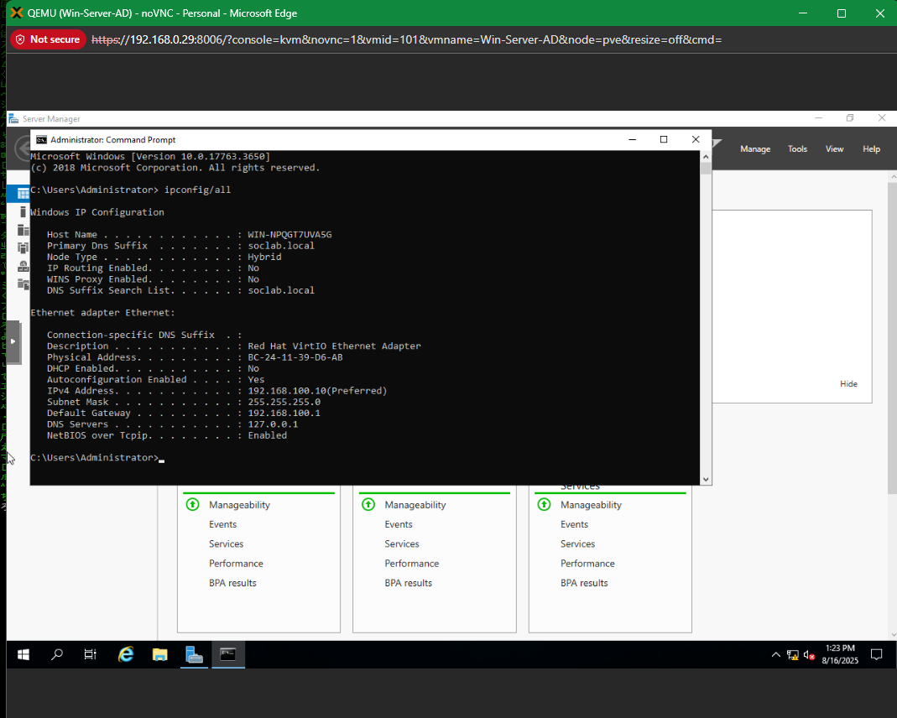
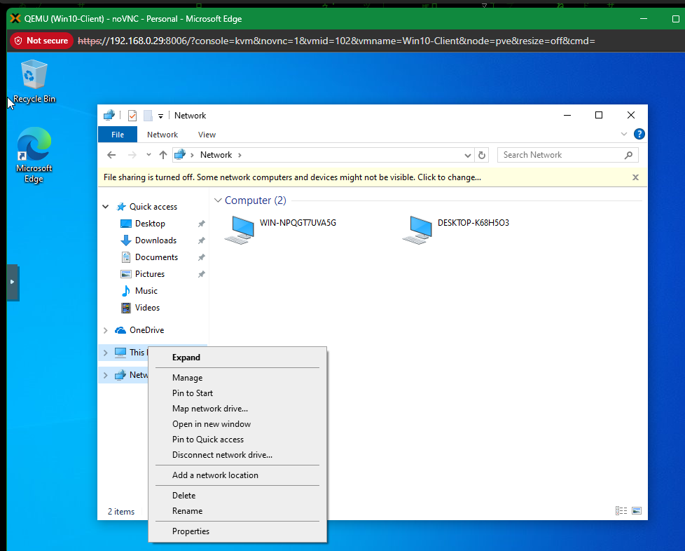
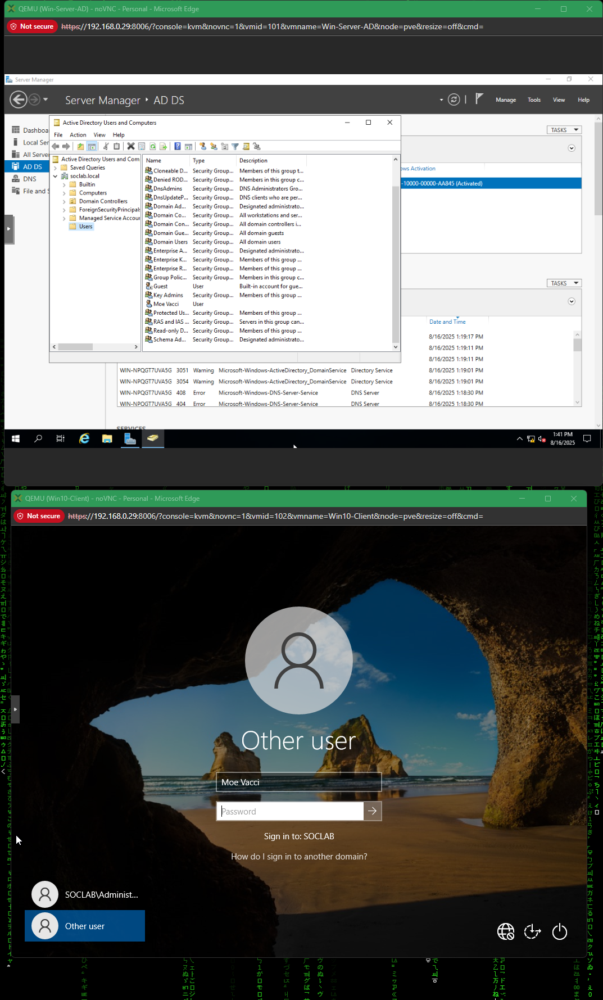
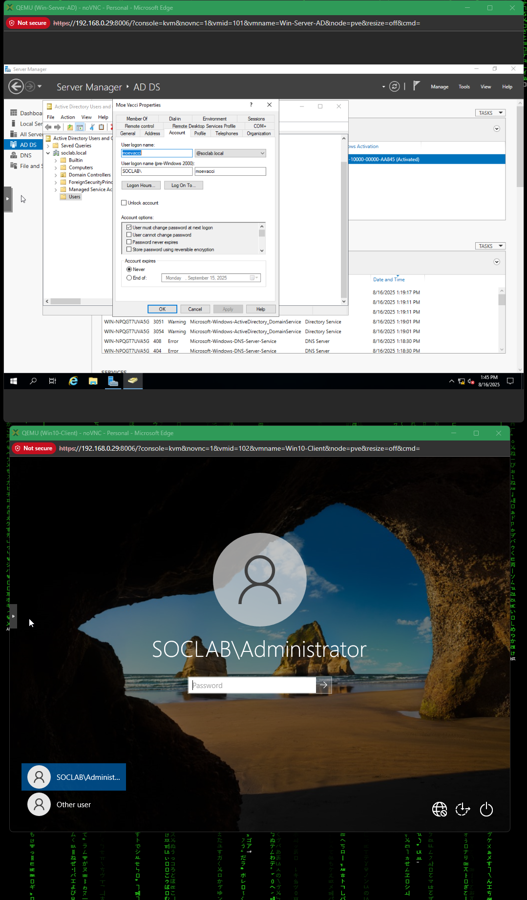
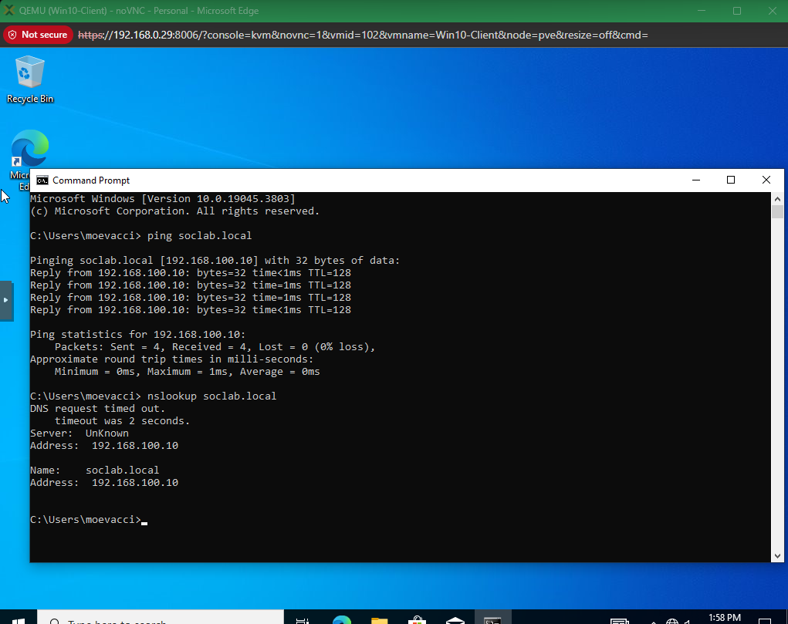
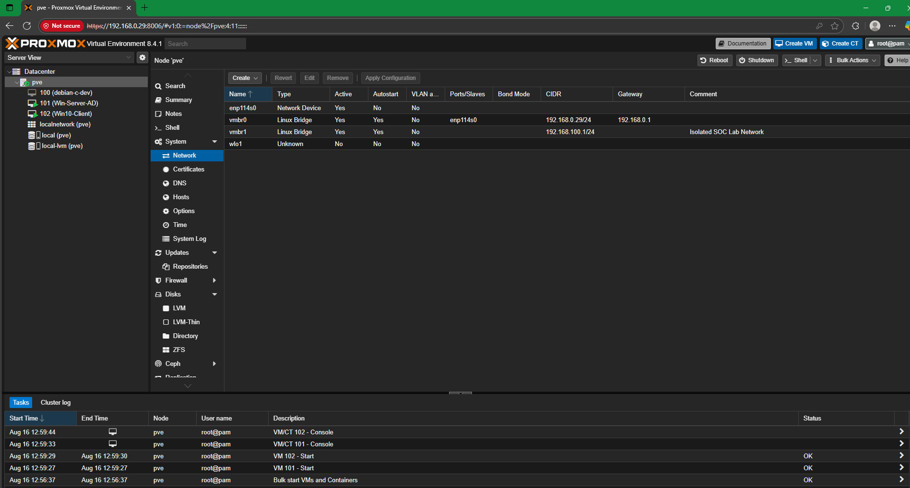

Step 7 – Windows 10 Client Domain Login
Context (what I was doing)

After configuring DNS and domain join in Step 6, the next step was to validate that a domain user could successfully authenticate on the Windows 10 client using Active Directory. This was the first real test of the authentication chain between the domain controller (Server 2019 AD DS) and the client.

## Actions Taken  

1. **Verified Server IP/DNS Configuration**  
   - Confirmed the domain controller had a static IP (`192.168.100.10`) and loopback DNS (`127.0.0.1`) with suffix `soclabs.local`.  
     

2. **Checked Client Visibility of Domain Resources**  
   - From the Windows 10 Client, verified network discovery and saw the domain controller hostname appear.  
     

3. **Reviewed Client Specifications Before Join**  
   - Validated system name (`DESKTOP-K68H5O3`) and OS version prior to joining domain.  
     

4. **Created and Prepared Domain User**  
   - In ADUC, confirmed domain user `moevacci` was created and configured for login.  
     

5. **Attempted Domain Login on Client**  
   - At the Windows 10 login screen, attempted to log in using `SOCLAB\moevacci`.  
     

6. **Validated User Properties in AD**  
   - Confirmed account details for `moevacci@soclabs.local`.  
     

7. **Connectivity Tests (Ping & nslookup)**  
   - Pinging `soclabs.local` worked consistently.  
   - `nslookup` showed timeouts initially, but eventually resolved correctly to the DC’s IP.  
     

8. **Verified Proxmox Isolated Network (vmbr1)**  
   - Confirmed both server and client were running inside the `vmbr1` isolated lab network.  
     

Result

Windows 10 Client successfully attempted domain login with SOCLAB\moevacci.

Authentication path between server and client validated end-to-end.

DNS resolution confirmed functional, though intermittent timeouts (linked to Error 5 – DNS IPv6).

Lab isolation via vmbr1 confirmed intact.

Lesson Learned

A successful ping doesn’t always mean DNS is fully working — nslookup highlighted hidden issues.

Clients rely entirely on the DC for DNS resolution; misconfiguration here will break logins.

Testing logon at the client side is the most conclusive way to confirm AD setup is working.

Auxiliary Screenshots

(01-aux-server-events.png) – AD DS/Server Manager showing domain service warnings and replication errors after promotion.
